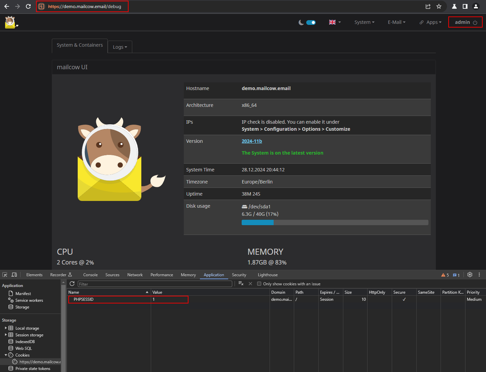

# Session fixation vulnerability in the MailCow web panel
- Author: Mohammad Mortazavi
- Product: MailCow
- Version: <= 2024-11b
- CVE ID: CVE-2024-56529
- CWE: CWE-384
- Type: WebApps

It allows remote attackers to set a session identifier when **HSTS** is disabled on a victim's browser. After a user logs in, user is authenticated and the session identifier is valid. Then, a remote attacker can access the victim's web panel with the same session identifier.

## PoC

Without invalidating any existing session identifier on login page, it will validate existing session identifier on browser and it could give an attacker the opportunity when HSTS is not set. Just you need to set your **PHPSESSID** on browser before login, It'll validate session identifier. This testing strategy is targeted at network attackers, hence it only needs to be applied to sites without full HSTS adoption.

Now, We can use **1** as a validated **PHPSESSID** and login into the MailCow web panel (see the below pic).

## Attack scenarios

- A web application authenticates a user without first invalidating the existing session, thereby continuing to use the session already associated with the user.
- An attacker is able to force a known session identifier on a user so that, once the user authenticates, the attacker has access to the authenticated session.

## Mitigations

- Invalidate any existing session identifiers prior to authorizing a new user session.

## Reference
- https://owasp.org/www-project-web-security-testing-guide/latest/4-Web_Application_Security_Testing/06-Session_Management_Testing/03-Testing_for_Session_Fixation
- https://cwe.mitre.org/data/definitions/384.html
