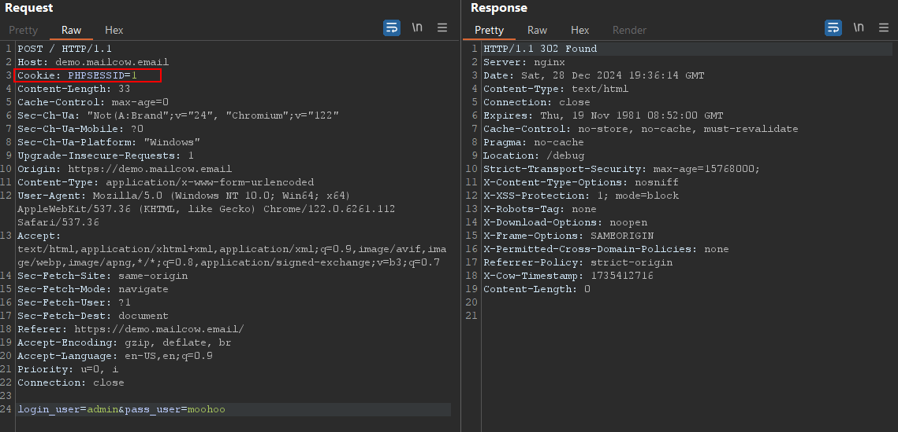

# Session fixation vulnerability in the MailCow web panel
- Author: Mohammad Mortazavi
- Product: MailCow
- Version: <= 2024-11b
- CVE ID: CVE-2024-56529
- CWE: CWE-384
- Type: WebApps

### Summary
The login page does not invalidate existing session identifiers, instead, it accepts and validates any session identifier stored in the browser. After the user logs in, they are authenticated, and the session identifier becomes valid. A remote attacker can then use the same session identifier to access the victim's web panel. In this case, this vulnerability allows remote attackers to set a session identifier when **HSTS** is disabled in the victim's browser.

## Details
Without invalidating any existing session identifier on login page, it will validate existing session identifier in browser, and it could give an attacker the opportunity when **HSTS** is not set. Just you need to set your **PHPSESSID** on browser before login, it'll validate session identifier. This testing strategy is targeted at network attackers; hence it only needs to be applied to sites without full **HSTS** adoption.

## PoC
While you are in login page on mailcow web panel, just change **PHPSESSID** to a every random string that you want and submit your username and password. you will see that it won't invalidated existing **PHPSESSID** and your string will be validated, it only needs to be applied to sites without full **HSTS** adoption.

Now, We can use **1** as a validated **PHPSESSID** and login into the MailCow web panel (see the below pic).

Then you can see your random string in **PHPSESSID** is validated. 

## Attack scenarios

- A web application authenticates a user without first invalidating the existing session, thereby continuing to use the session already associated with the user.
- An attacker is able to force a known session identifier on a user so that, once the user authenticates, the attacker has access to the authenticated session.

## Mitigations

- Invalidate any existing session identifiers prior to authorizing a new user session.

## Reference
- https://owasp.org/www-project-web-security-testing-guide/latest/4-Web_Application_Security_Testing/06-Session_Management_Testing/03-Testing_for_Session_Fixation
- https://cwe.mitre.org/data/definitions/384.html
